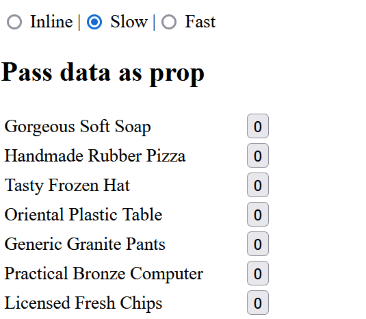

# reactive-iteration

How can we efficiently render a long list of items where the items can change? 
We only want to re-render the items that changes, not the entire list. 

Here we use a technique where we "pass a hook as a prop": 
Instead of passing all data, we pass a hook which returns that data row by row.

This technique is useful for implementing reusable components that display large amounts of live or editable data, like tables, trees and charts.

Note that the code relies on "selectors" to make a component (here the table row component) subscribe to a selected slice of some state. Here we use `useSelector` from [Redux](https://www.npmjs.com/package/redux), but any other state management solution with selectors would work as well, like Zustand.

This technique is yet another example of the [general principle](https://en.wikipedia.org/wiki/Fundamental_theorem_of_software_engineering) in software engineering where many problems can be solved with another level of indirection.

## Demo

A stock of 10.000 products with their quantity. Click the quantity to increase the stock.

```bash
npm install
npm start
```

- Inline - no resuable Table component is used, this can be fast.
- Slow - a resuable Table component is fed all data, this is slow.
- Fast - a resuable Table component is fed a `useRow` hook, this is fast.
- React Context - Like "Fast" but with React Context instead of Redux
- React.memo - Wrap each TableRow in React.memo




## Credits

Thanks to:
- [faker](https://github.com/faker-js/faker) for the fake product list.